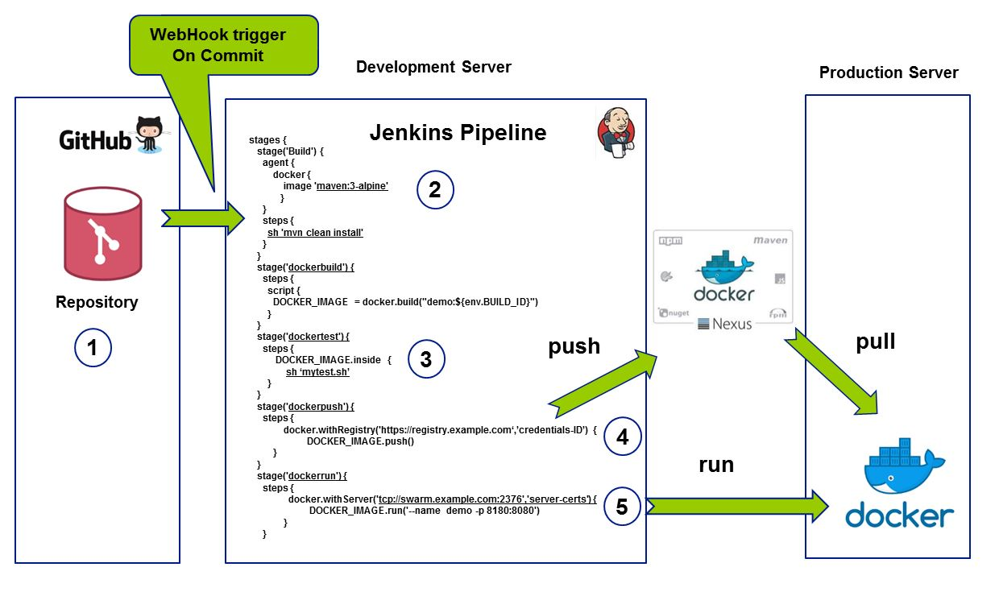

# Spring Cloud, Jenkins Pipelines and Docker demonstrated, all you need to go DevOps
This source goes with the content of www.agile-solutions.ch. This code demonstrates how to build productive ready business solutions with Spring Boot/Cloud and build and provision your applications on Docker through Jenkins Pipelines. Read the instruction further on this page how to run this demo on [play with docker](https://labs.play-with-docker.com/)

## DevOps with Jenkins Pipelines & Docker
Picture explains how to build, test, package on one Linux box running Jenkins as a Docker Container and pull and run Docker Containers on a Production Linux box from one pipeline. You can play through this scenario on [Play with Docker](https://labs.play-with-docker.com/) if you wish, believe me, it works.

1. Commit on the master branch of your repo triggers remote Jenkins Pipeline through webhooks trigger.
2. Jenkins pipeline clones git repo, maven builds your application with Docker Agent running maven 3 alpine image (service container)
3. Jenkins test pipeline stage runs some tests on the image you just produced with the docker buildfile on your git repository
4. Docker push your image on the NEUXS 3 Docker registry, credentials ID is simply a Jenkins Username-Password credential object for logging on to the NEXUS repository.
5. Docker remote run and pull the image from the central Docker Hub registry
6. Read this [Using Docker with Pipelines](https://jenkins.io/doc/book/pipeline/docker/)
7. Then read this [Building docker images with jenkins pipelines](https://getintodevops.com/blog/building-your-first-docker-image-with-jenkins-2-guide-for-developers)

## Run Docker in Container

Bind host Docker sockets into your jenkins blueocean container.
read [Jenkins in Container](https://jenkins.io/doc/tutorials/create-a-pipeline-in-blue-ocean/)

## Play with Docker
Go to PWD Docker Playground and play around with Jenkins on Docker from interactive [play with docker](https://labs.play-with-docker.com/)

## Run jenkins in container and bind host docker

* create directory /jenkins
* docker run -d --name jenkins --user root -p 8080:8080 -v /jenkins:/var/jenkins_home -v /var/run/docker.sock:/var/run/docker.sock jenkinsci/blueocean
* docker logs -f jenkins
* docker exec -ti jenkins bash
* docker ps -a
* browse to http://localhost:8080 and wait until the Unlock Jenkins page appears.
* get password from /jenkins/secrets/initialAdminPassword

## About this example
All changes I put on top of this original version https://github.com/azarai/spring-boot-intermediate-microservices
1. Change native to GIT config store
2. Add Swagger UI 
3. Add Spring Cloud Sleuth and ELK to track business transactions over SPAN's

## OpenID Connect and access management Spring Boot with Keycloak

1. read this excellent introduction [Introducing Keycloak for Identity and Access Management](https://www.thomasvitale.com/introducing-keycloak-identity-access-management/)
2. run Keycloak on [Play with Docker](https://labs.play-with-docker.com) with "docker run --name keycloak -e KEYCLOAK_USER=admin -e KEYCLOAK_PASSWORD=admin -p 8080:8080 jboss/keycloak"

## readings
1. [spring cloud tutorial](http://www.baeldung.com/spring-cloud-tutorial)
2. [spring cloud io](http://projects.spring.io/spring-cloud/)
3. [excellent getting started page](https://howtodoinjava.com/spring/spring-cloud/spring-cloud-config-server-git/)
4. [Eclipse Spring Tools getting started](https://o7planning.org/en/11723/understanding-spring-cloud-config-server-with-example)
5. [GIT as config backend](https://dzone.com/articles/spring-cloud-config-series-part-2-git-backend)

## config branch model
1. [How to maintain different configurations for different feature branches](http://www.naturalprogrammer.com/spring-cloud-config-maintain-configuration-branches/)
2. [Read the 12 app specs about this](https://12factor.net/config)
3. [spring io specs](http://cloud.spring.io/spring-cloud-static/spring-cloud-config/2.0.0.RC1/multi/multi_spring-cloud-config.html)

## references
1. [spring cloud github](https://github.com/spring-cloud)

## building
1. mvn clean install

## running and loading the dev configurations
1. mvn clean spring-boot:run -Dspring.cloud.config.label=dev

## verifiy config server
1. java -jar target\spring-config-server-0.0.1-SNAPSHOT.jar
2. http://localhost:8888/config-server-client/development
3. http://localhost:8888/config-server-client/production

## about actuator and productive ready features
1. [actuator endpoints](https://docs.spring.io/spring-boot/docs/current/reference/htmlsingle/#production-ready)
